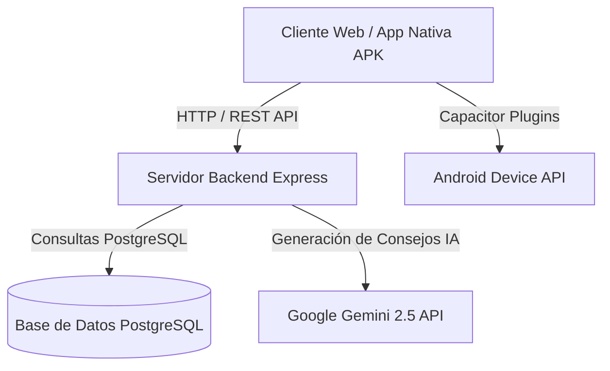

<div align="center">
  
  
  # 🌸 MenteClara
  ### *Plataforma Inteligente de Autorregulación Estudiantil y Enfoque Cognitivo*

  [](https://react.dev/)
  [](https://www.typescriptlang.org/)
  [](https://tailwindcss.com/)
  [](https://www.postgresql.org/)
  [](https://expressjs.com/)
  [](https://ai.google.dev/)
  [](https://capacitorjs.com/)

  <p align="center">
    <b>MenteClara</b> combina principios de <i>Interacción Humano-Computadora (IHC)</i> y <i>Psicología Cognitiva</i> para disolver la parálisis por análisis, gestionar la ansiedad académica y estructurar sesiones de micro-enfoque adaptativo impulsadas por IA.
  </p>
</div>

---

## 📑 Tabla de Contenidos

1. [✨ Características Principales](#-características-principales)
2. [📚 Centro de Documentación Tecnica](#-centro-de-documentación-técnica)
3. [🚀 Guía de Inicio Rápido](#-guía-de-inicio-rápido)
4. [🔑 Credenciales de Prueba](#-credenciales-de-prueba-semilla)
5. [⚙️ Comandos Disponibles](#️-comandos-disponibles)
6. [🏛️ Arquitectura y Tecnologías](#️-arquitectura-y-tecnologías)

---

## ✨ Características Principales

<table>
  <tr>
    <td width="50%">
      <h3>🌀 Focus Vortex Central</h3>
      <p>Organizador visual interactivo que permite arrastrar y jerarquizar tareas según el nivel de estrés percibido (Bajo, Moderado, Muy Alto).</p>
    </td>
    <td width="50%">
      <h3>🤖 Tutor IA de Paz (Google Gemini)</h3>
      <p>Asistente cognitivo que analiza pendientes complejos y los divide en micro-pasos ejecutables con recomendaciones diafragmáticas.</p>
    </td>
  </tr>
  <tr>
    <td width="50%">
      <h3>🧘 Desconexión Activa & Mindfulness</h3>
      <p>Sesiones guiadas de respiración 4-7-8 con animaciones expansivas para reducir la carga fisiológica antes de estudiar.</p>
    </td>
    <td width="50%">
      <h3>📱 Experiencia Multiplataforma Híbrida</h3>
      <p>Interfaz web adaptativa y compilación nativa en Android (APK) con sincronización de datos y diseño optimizado por plataforma.</p>
    </td>
  </tr>
</table>

---

## 📚 Centro de Documentación Técnica

Para explorar en profundidad cada área del proyecto, consulta nuestros módulos de documentación dedicada:

> [!NOTE]
> ### 📖 [Arquitectura y Estructura del Código](docs/ESTRUCTURA.md)
> *Detalle completo de carpetas, componentes de React, esquemas relacionales de PostgreSQL y fundamentos cognitivos.*

> [!TIP]
> ### ☁️ [Guía de Despliegue en Producción](docs/DESPLIEGUE.md)
> *Instrucciones paso a paso para desplegar la base de datos PostgreSQL y la API Node.js en Render.com.*

> [!IMPORTANT]
> ### 📱 [Guía de Compilación Nativa (Android APK)](docs/GENERACION_APK.md)
> *Pasos para empaquetar, sincronizar assets y compilar `menteclara.apk` usando Capacitor y Gradle.*

---

## 🚀 Guía de Inicio Rápido

### Requisitos Previos

* **Node.js**: `v20.x` o superior.
* **PostgreSQL**: Instancia local en ejecucion (puerto `5432`).

### 1. Clonar y Configurar el Entorno

```bash
# Copiar plantilla de variables de entorno
cp .env.example .env
```

Edita tu archivo `.env` con las credenciales de tu base de datos local y la clave de Gemini:

```env
# Google Gemini AI Key
GEMINI_API_KEY="tu_gemini_api_key"

# Conexión Local PostgreSQL
SQL_HOST="localhost"
SQL_USER="postgres"
SQL_PASSWORD="root"
SQL_DB_NAME="mentesana"

# Servidores Local
SKIP_VITE_MIDDLEWARE="true"
VITE_API_URL="http://localhost:3000"
```

### 2. Ejecutar la Aplicación

```bash
npm run dev
```

Este comando verifica la base de datos, ejecuta migraciones automáticas, inserta los datos semilla y levanta en paralelo:
* 🌐 **Frontend (Vite)**: `http://localhost:5173`
* ⚙️ **Backend API (Express)**: `http://localhost:3000`

---

## 🔑 Credenciales de Prueba (Semilla)

Al ejecutar `npm run dev`, el sistema inicializa automáticamente una cuenta de prueba lista para usar:

```text
┌──────────────────────────────────────────────────────────────┐
│  📧 Correo:      user@gmail.com                              │
│  🔑 Contraseña:  user                                        │
│  👤 Nombre:      user                                        │
└──────────────────────────────────────────────────────────────┘
```

---

## ⚙️ Comandos Disponibles

| Comando | Descripción |
| :--- | :--- |
| `npm run dev` | Inicializa BD, aplica migraciones, inserta datos semilla y arranca Backend + Frontend. |
| `npm run dev:backend` | Ejecuta exclusivamente el servidor API Express (`server/server.ts`). |
| `npm run dev:frontend` | Ejecuta exclusivamente el servidor de desarrollo Vite (`http://localhost:5173`). |
| `npm run build` | Compila el paquete web en `/dist` y genera la build del servidor. |
| `npm run lint` | Ejecuta el análisis estático de TypeScript (`tsc --noEmit`). |

---

## 🏛️ Arquitectura y Tecnologías



---

<div align="center">
  <sub>Desarrollado para promover el bienestar estudiantil y la productividad académica.</sub>
</div>
