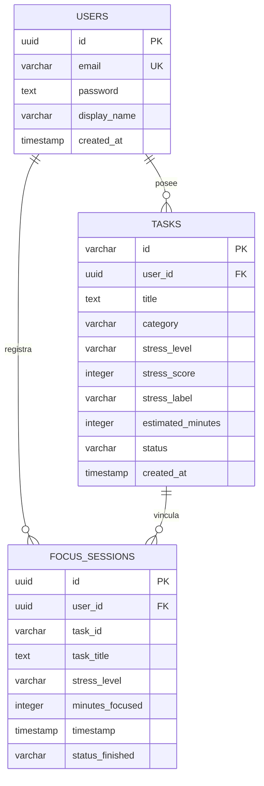

# 🏛️ Arquitectura y Estructura del Proyecto — MenteClara

MenteClara está diseñada bajo una **arquitectura en capas desacopladas**, separando limpiamente la interfaz de usuario, los servicios de API backend y la capa de almacenamiento relacional PostgreSQL.

---

## 📑 Contenido del Módulo

1. [📂 Árbol de Directorios](#-árbol-de-directorios)
2. [🗄️ Modelo Relacional de Base de Datos](#️-modelo-relacional-de-base-de-datos)
3. [🧩 Componentes Principales de Interfaz](#-componentes-principales-de-interfaz)
4. [🧠 Principios de Diseño Cognitivo (IHC)](#-principios-de-diseño-cognitivo-ihc)

---

## 📂 Árbol de Directorios

```text
IMH/V02/
├── android/                         # Proyecto Nativo Android (Capacitor Engine)
│   ├── app/
│   │   ├── build.gradle             # Configuración Gradle (Genera menteclara.apk)
│   │   └── src/main/
│   │       ├── AndroidManifest.xml  # Configuración de Intent Filters & Deep Links
│   │       └── res/                 # Iconos adaptativos e imágenes del sistema
├── docs/                            # Centro de Documentación Técnica
│   ├── ESTRUCTURA.md                # Este documento (Arquitectura y Modelo de Datos)
│   ├── DESPLIEGUE.md                # Guía de despliegue en Render.com
│   └── GENERACION_APK.md            # Guía de compilación nativa APK
├── server/                          # Servidor Backend API Node.js
│   ├── server.ts                    # Punto de entrada Express, CORS y middleware
│   └── services/
│       └── geminiService.ts         # Conector con el SDK oficial de Google Gemini AI
├── src/                             # Aplicación React + TypeScript
│   ├── components/                  # Componentes de la interfaz de usuario
│   │   ├── FullScreenAuth.tsx       # Pantalla de autenticación adaptable (Web/APK)
│   │   ├── AuthAndProfileModal.tsx  # Modal de gestión de sesión y perfil
│   │   ├── FocusVortex.tsx          # Vórtice interactivo de jerarquización de tareas
│   │   ├── BreathingExerciseModal.tsx # Ejercicios guiados de respiración 4-7-8
│   │   ├── StatsDashboard.tsx       # Panel de métricas y gráficos de progreso
│   │   └── InteractiveGuideModal.tsx# Guía de tutoría psicológica e IHC
│   ├── lib/
│   │   └── auth.ts                  # Gestor de sesiones locales y OAuth
│   ├── App.tsx                      # Orquestador principal de vistas y estados
│   └── index.css                    # Sistema de diseño con tokens HSL y Tailwind
├── capacitor.config.ts              # Configuración nativa de Capacitor
├── start-dev.js                     # Automatización de desarrollo y seed de BD
├── .env.example                     # Plantilla pública de variables de entorno
└── package.json                     # Manifiesto de dependencias y scripts
```

---

## 🗄️ Modelo Relacional de Base de Datos



### Detalle de Tablas

#### 1. `users`
Guarda el registro de usuarios del sistema (autenticación local y perfiles).

| Campo | Tipo | Descripción |
| :--- | :--- | :--- |
| `id` | `UUID` | Clave primaria generada por la base de datos |
| `email` | `VARCHAR(255)` | Correo electrónico único del usuario |
| `password` | `TEXT` | Hash encriptado de la contraseña |
| `display_name` | `VARCHAR(255)` | Nombre para mostrar en el perfil |
| `created_at` | `TIMESTAMP` | Fecha de creación del registro |

#### 2. `tasks`
Gestión de pendientes académicos con metadata de estrés percibido.

| Campo | Tipo | Descripción |
| :--- | :--- | :--- |
| `id` | `VARCHAR(255)` | Clave primaria de la tarea |
| `user_id` | `UUID` | Clave foránea referenciando a `users.id` |
| `title` | `TEXT` | Descripción del pendiente |
| `category` | `VARCHAR(100)` | Categoría (Universidad, Examen, etc.) |
| `stress_level` | `VARCHAR(50)` | Nivel de estrés (`low`, `medium`, `high`) |
| `stress_score` | `INTEGER` | Escala numérica de estrés (1 a 5) |
| `stress_label` | `VARCHAR(100)` | Etiqueta descriptiva (ej. *Muy Alto*) |
| `estimated_minutes` | `INTEGER` | Estimación de duración |
| `status` | `VARCHAR(50)` | Estado de la tarea (`pending` / `completed`) |

#### 3. `focus_sessions`
Métricas históricas de concentración e interrupciones.

| Campo | Tipo | Descripción |
| :--- | :--- | :--- |
| `id` | `UUID` | Clave primaria |
| `user_id` | `UUID` | Clave foránea referenciando a `users.id` |
| `task_id` | `VARCHAR(255)` | Tarea vinculada a la sesión |
| `minutes_focused` | `INTEGER` | Tiempo acumulado de estudio activo |
| `status_finished` | `VARCHAR(50)` | Resultado (`completed` / `interrupted`) |

---

## 🧠 Principios de Diseño Cognitivo (IHC)

> [!NOTE]
> ### 1. Reducción de la Parálisis por Análisis
> Las tareas de mayor complejidad o estrés se destacan visualmente para permitir su fragmentación en micro-pasos guiados por IA antes de iniciar la cuenta regresiva.

> [!TIP]
> ### 2. Retroalimentación Somática (Mindfulness 4-7-8)
> Incorpora animaciones concéntricas que marcan los tiempos respiratorios diafragmáticos para estabilizar la frecuencia cardíaca antes de enfrentar tareas de estrés alto.

> [!IMPORTANT]
> ### 3. Adaptabilidad por Entorno
> La interfaz detecta automáticamente si se ejecuta desde un navegador web o desde el paquete móvil nativo Android, adaptando la experiencia de autenticación para eliminar fricciones innecesarias.
