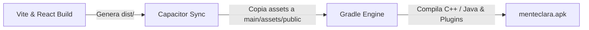

# 📱 Guía de Compilación Nativa (Android APK) — MenteClara

Esta guía describe el procedimiento para transformar el código fuente web React + Vite en un paquete ejecutable nativo para la plataforma **Android (`menteclara.apk`)** usando **Capacitor CLI** y **Gradle**.

---

## 🛠️ Requisitos del Entorno

* **Java Development Kit**: JDK 17 o superior (`JAVA_HOME` configurado).
* **Android SDK / Build-Tools**: Gestionados vía Android Studio o Gradle Wrapper.
* **Capacitor CLI**: `@capacitor/cli` v8.x.

---

## ⚡ Comando de Compilación Unificado

Para sincronizar la compilación de React, empaquetar los assets e invocar la generación del binario APK en un solo paso:

```bash
npm run build; npx cap sync android; cd android; .\gradlew assembleDebug
```

### 🔍 Fases de Compilación



1. **`npm run build`**: Compila los componentes de React, TypeScript y Tailwind CSS en `/dist`.
2. **`npx cap sync android`**: Sincroniza los assets compilados y actualiza los plugins nativos (`@capacitor/browser`, `@capacitor/app`).
3. **`.\gradlew assembleDebug`**: Ejecuta el motor Gradle para empaquetar el ejecutable `.apk`.

---

## 📦 Ubicación del APK Generado

El instalador compilado personalizado se genera en la siguiente ruta interna:

```text
android/app/build/outputs/apk/debug/menteclara.apk
```

---

## ⚙️ Personalización del Nombre en `android/app/build.gradle`

Para asegurar que Gradle emita siempre el archivo con la denominación `menteclara.apk`, el archivo `build.gradle` contiene el siguiente bloque de variación:

```groovy
android {
    ...
    applicationVariants.all { variant ->
        variant.outputs.all { output ->
            outputFileName = "menteclara.apk"
        }
    }
}
```

---

## 🎨 Adaptabilidad por Plataforma (Web vs APK)

> [!TIP]
> ### Detección de Plataforma Dinámica:
> MenteClara utiliza `Capacitor.isNativePlatform()` en la interfaz. Cuando la aplicación se ejecuta dentro del paquete APK, la opción de sincronización con Google se oculta automáticamente para ofrecer una experiencia fluida y sin ventanas externas.
